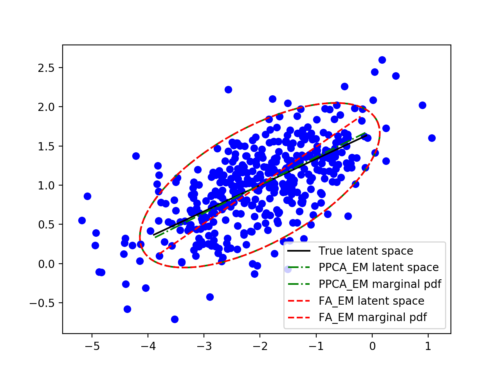
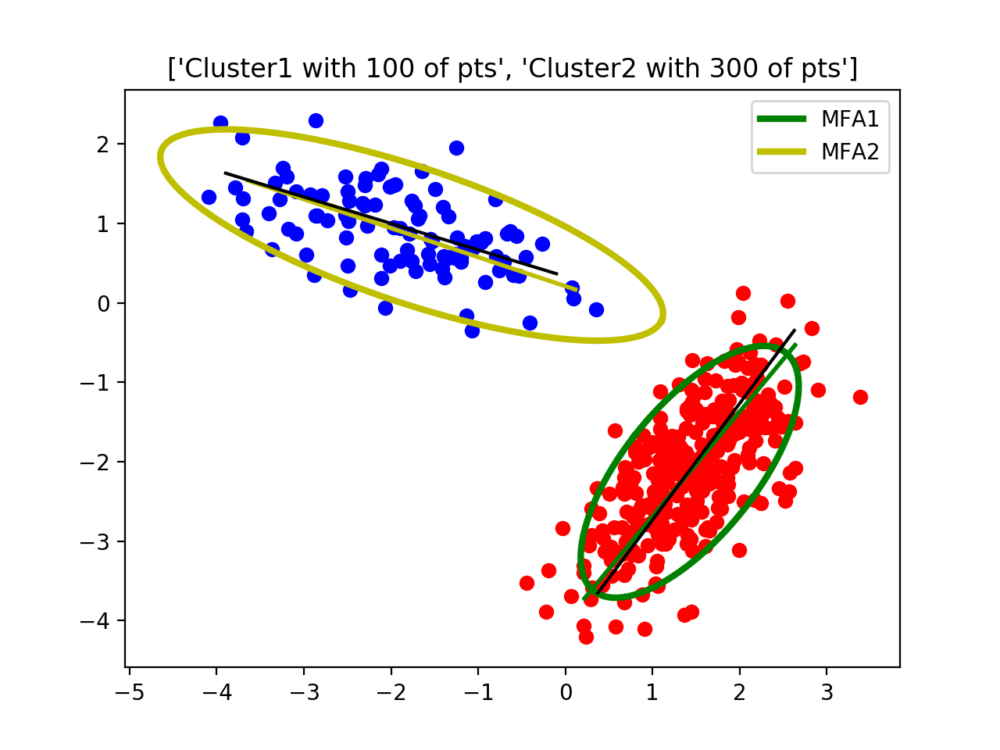

# MixtureFA (Mixtures of Factor Analyzers)

This is a toolbox written in python for training/inferencing the (Mixture of) Factor Analyizer.

>(Only in Mandarin) Detailed math of FA/MFA: see [blog](https://bobondemon.github.io/2018/02/11/Mixtures-of-Factor-Analyzers/)

---
## Usage

### FA

```python
from mixture_latent_analysis import fa_em

# Train
# Input:
#   X: (D,N) matrix, where D is obervation dimension and N is observation number
#   K: scalar, indicates the dimension of latent space
# Return:
#   FA follows the following linear-Gaussian Model: p(x|z) ~ N(mu+Wz, diag(psi))
#   mu, (D,1)
#   W, (D,K)
#   psi, (D,)
mu, W, psi = fa_em(X,K)

# Inference
# X is of dim (D,N), where N is number of data points
# W is of dim (D,K)
# mu is of dim (D,1)
# psi is of dim (D,)
# Return:
# 	Z, (K,N)
# 	ZinXSpace, (D,N)
Z, ZinXSpace = fa_inference(X,mu,W,psi)
```

### MFA

```python
from mixture_latent_analysis import mfa_em

# Train
# Input:
#   X: (D,N) matrix, where D is obervation dimension and N is observation number
#   K: scalar, indicates the dimension of latent space
#   M: scalar, indicates the number of mixture components
# Return:
#   For a given mixture component j, p(x|zj) ~ N(mu[j,:]+W[j,...]zj, diag(psi))
#   pi, (M,): the mixture weights, sum(pi)=1
#   mu, (M,D)
#   W, (M,D,K)
#   psi, (D,)
pi, mu, W, psi = mfa_em(X,K,M)

# Inference
# X is of dim (D,N), where N is number of data points
# W is of dim (M,D,K)
# mu is of dim (M,D)
# psi is of dim (D,)
# Return:
# 	Z, (M,K,N)
# 	ZinXSpace, (M,D,N)
Z, ZinXSpace = mfa_inference(X,mu,W,psi)
```

---
## Toy Example

For running the toy examples, type:

```bash
>> # FA toy example
>> python expToyData.py 
```



```bash
>> # MFA toy example
>> python expToyData_mixture.py 
```



---
## TODO

1. MFA: `mu` 初始化使用 k-means
